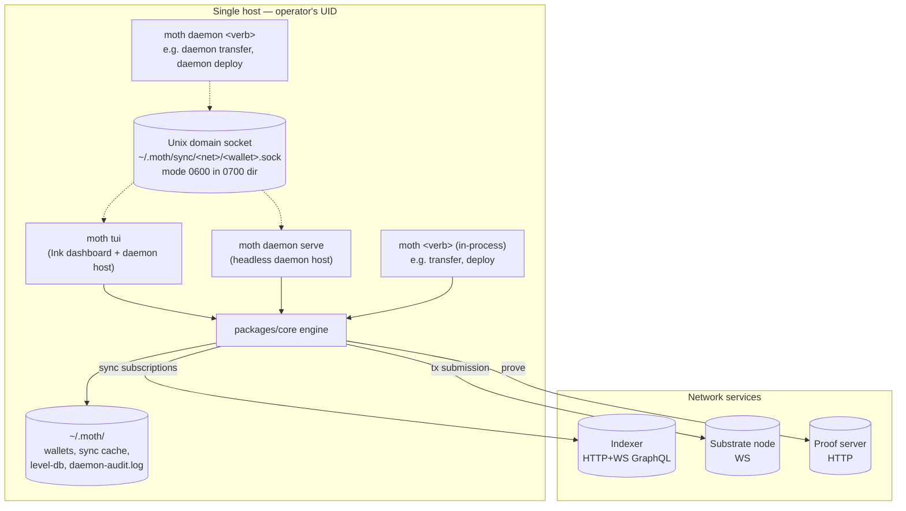
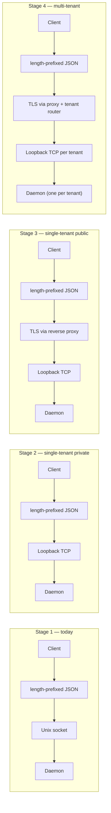

# 01 — Architecture

## Context

The wallet host runs in one of three shapes today; the spec needs to describe how each one fits together and what changes at each stage of the roadmap from `moth daemon serve` on a developer laptop to a network-accessible single-tenant service to multi-tenant custody. This section is descriptive of stage 1 (where we are) and prescriptive about stages 2–4.

## System architecture (stage 1)

The TUI and `daemon serve` are the two ways to host the daemon socket. In-process CLI commands bypass the daemon entirely; daemon-mode CLI commands skip starting their own sync and ask the socket-hosting process to do the work.

## Process model

| Shape | Hosts the wallet | Has UI | Lifecycle owner |
|---|---|---|---|
| TUI (`moth tui`) | Yes, in-process | Yes (Ink) | Terminal session |
| `moth daemon serve` | Yes, headless | No | Operator / process supervisor |
| In-process CLI commands (`moth transfer`, `moth deploy`, …) | Yes, per-invocation | Inherited from terminal | The CLI invocation itself |
| Daemon-mode CLI commands (`moth daemon transfer`, `moth daemon deploy`, …) | No — connects to a hosting daemon | Inherited from terminal | The CLI invocation itself |

A daemon and an in-process CLI on the same host **must not** sync the same wallet at the same time — both would open WS subscriptions to the indexer, double the reconnect-induced re-sent boundary events that trigger the SDK off-by-one we work around in `sync/sdk-dedup.ts`, and race on the on-disk sync cache. The daemon-mode CLI commands exist precisely to make this avoidable: if a daemon is running, every CLI invocation routes through it; the CLI does not start its own wallet sync.

## Transport per stage

| Stage | Transport | AuthN | AuthZ | Reachable from |
|---|---|---|---|---|
| 1 (today) | Unix domain socket, mode `0600` in `~/.moth/sync/<network>/<wallet>.sock` (dir `0700`) | Kernel UID check on the socket file | None (single human operator) | Same UID on the same host |
| 2 (transport + AuthN landed) | Loopback TCP (`--transport tcp --bind 127.0.0.1:<port>`), same length-prefixed JSON frames as stage 1 | API key token (`<id>.<secret>` shape, presented via the `auth` RPC; SHA-256 of salt+secret verified with `timingSafeEqual` against `~/.moth/api-keys/<id>.key`). Generated by `moth daemon key gen`. | Per-key scopes + spend caps (see [03](./03-authorization-policy.md)) — not yet implemented; today every key gets full write access. | Same host |
| 3 | TCP + TLS on a public bind address | API key, optionally + mTLS | Same as stage 2 plus tiered async approval (see [04](./04-approval-pipeline.md)) | Anywhere allowed by the operator's firewall |
| 4 | Same as stage 3, plus an upstream proxy for tenant routing | mTLS or OAuth2 client credentials | Multi-tenant policy engine | Wider — multiple Web2 apps for multiple users |

The on-the-wire framing (length-prefixed JSON, declared in `packages/core/src/daemon/protocol.ts`) is stage-stable: stage 2 runs the exact same frames over a TCP socket instead of a Unix socket. Stage 3 adds TLS wrapping but does not change the framing. The protocol version constant (`moth-wallet-daemon/1`) only bumps when the frame format itself changes.

The framing layer (length-prefixed JSON) is constant across all four stages — the only thing that changes between them is the transport beneath it.

## Deployment shape per stage

### Stage 1 — laptop / single-host

- TUI or `moth daemon serve` invoked manually by an operator.
- Socket lifecycle tied to the process.
- Configuration via CLI flags and a few env vars (`MOTH_PASSPHRASE`, `MOTH_DAEMON_AUTO_APPROVE`).
- Logs to stderr; no rotation, no audit log file (D-KM-3 + [06] acknowledge this).
- Operational footprint: one process, one wallet, one host.

### Stage 2 — single-tenant private network

- `moth daemon serve --transport tcp --bind 127.0.0.1:<port>` (subcommand flags TBD; the daemon binds loopback to start).
- Operator runs it under a process supervisor (systemd is the reference choice; Docker is supported via the same binary in a container with `--bind 0.0.0.0:<port>` and the container's network namespace restricting reachability).
- Configuration moves to `~/.moth/daemon.toml` (per the open-question resolution below). CLI flags override TOML; env vars override flags.
- Audit log file at `~/.moth/daemon-audit.log`, rotated daily.
- One process per wallet. Operators with multiple wallets run multiple instances on different ports.

### Stage 3 — single-tenant public network

- Same binary as stage 2; reverse proxy (nginx, Caddy) in front of it terminates TLS and forwards to the loopback socket. The daemon never sees raw TLS traffic itself — that's a deliberate separation so cert rotation is a proxy concern, not a daemon concern.
- API key + (optional) mTLS in nginx; daemon trusts a header the proxy sets after auth.
- Same systemd / Docker pattern as stage 2.

### Stage 4 — multi-tenant custodial

- One daemon process per tenant, fronted by a router that maps inbound calls to the right backend. Or: one daemon that holds multiple wallets and routes verbs to the right one based on an auth claim. We commit to the former in [08-multi-tenant-roadmap.md](./08-multi-tenant-roadmap.md) — process isolation between tenants is the only sensible default given the threat model.
- Keys live in a KMS / HSM / TEE (D-KM-5) rather than the daemon's RAM.

## Dependencies the daemon talks to

| Service | Role | Trust | Network direction |
|---|---|---|---|
| Indexer | Read sync events, query contract state | Read-only; can lie about balances but cannot spend | Daemon → indexer (WS subscriptions + HTTP queries) |
| Proof server | Generate ZK proofs during write paths | **Sees witness data in cleartext** during proving — see [09](./09-threat-model.md) — but cannot spend without the wallet | Daemon → proof server (HTTP) |
| Substrate node | Submit transactions, query chain state | Public chain; standard substrate trust | Daemon → node (WS) |
| KMS / HSM / TEE | Hold spending keys (stage 4) | Trusted compute element | Daemon → KMS (out-of-band; depends on KMS provider) |
| Confirmation channel (Slack/email/webhook) | Async approval for over-policy ops (stage 3+) | Trusted operator-side notification path | Daemon → notification service (HTTPS) |

The **proof-server witness exposure** is the most consequential of these. Today the proof server is a local Docker container running alongside the daemon; in a stage-3 deployment that's still fine for single-tenant single-host. For multi-tenant deployments the proof server boundary needs revisiting — either it must live in a TEE alongside the daemon's spending keys, or per-tenant proof servers run in their own isolation. [09](./09-threat-model.md) tracks this as a primary open question.

## Verb surface

The daemon's RPC verbs are defined in `packages/core/src/daemon/wallet-rpc-types.ts`. As of D3d+3 + the shared-factory refactor:

| Verb | Class | Stage 1 access | Stage 2+ access |
|---|---|---|---|
| `version` | Handshake | All callers | All callers |
| `getState` | Read | All callers | Per-key scope `read` |
| `clearSyncCache` | Write (L3) | Human approves modal | Policy + approval |
| `submitTransaction` | Write (L3) | Human approves modal | Policy + approval |
| `transferTokens` | Write (L3) | Human approves modal | Policy + approval |
| `callCircuit` | Write (L3) | Human approves modal | Policy + approval |
| `deployContract` | Write (L3) | Human approves modal | Policy + approval |
| `dustRegister` / `dustDeregister` | Write (L3) | Human approves modal | Policy + approval |
| `insertVerifierKey` / `insertVerifierKeysBatch` | Write (L3) | Human approves modal | Policy + approval |

The class column drives the AuthZ check at stage 2+ — read-class verbs can be authorized for an API key without spend caps; write-class verbs always go through the policy engine.

## Decisions

### D-ARCH-1: Same protocol frames across all transports

Length-prefixed JSON over the connection. TCP and Unix-socket transports use byte-identical frames. TLS at stage 3 is added by a reverse proxy, not by the daemon — keeps the daemon's transport code simple and makes cert rotation operationally clean.

**Implication**: a client library (CLI today, Web2 SDK later) that speaks the protocol works against any transport without code change.

### D-ARCH-2: One daemon per wallet, not one daemon per machine

Each wallet has its own socket (`<wallet>.sock`) and its own daemon process. Operators with N wallets run N daemons. This makes process isolation the default for stage 4 and removes "which wallet did this call target" ambiguity from the protocol.

**Cost**: more processes to manage. **Mitigation**: a future `moth daemon supervisor` command can manage the fleet from one place if it becomes annoying.

### D-ARCH-3: Configuration precedence — CLI > env > TOML > default

`~/.moth/daemon.toml` is the canonical config. CLI flags override file. Env vars override file but not CLI flags. Defaults baked in.

Lives at `~/.moth/daemon.toml` to match the existing `~/.moth/wallets/`, `~/.moth/sync/`, `~/.moth/config.json` layout. Same `0700` directory perms.

### D-ARCH-4: Reverse-proxy TLS, not in-daemon TLS

Defer TLS termination to nginx or Caddy in stage 3+. Daemon stays plain HTTP on a loopback bind. The proxy is responsible for cert provisioning (Let's Encrypt automation works fine), rotation, and client-cert verification when mTLS is configured.

**Why**: cert rotation is the most operationally annoying part of TLS. Letting nginx handle it means the daemon doesn't need to be restarted to pick up new certs.

**Caveat**: the proxy needs to be configured to forward client identity (the client cert's CN, or a verified Bearer token) to the daemon via a trusted header. The daemon trusts that header unconditionally because the only thing that can reach its loopback socket is the proxy.

## Open questions

1. **Hot reload of policy** (stage 3+) — `SIGHUP` re-reads the TOML policy file without restart? Or signal via the daemon's own RPC (`reloadPolicy`)? The signal route is operationally familiar but loses the audit trail; the RPC route gets policy reloads into the audit log alongside everything else. Probably the latter.

2. **Connection multiplexing** — today every CLI invocation opens a fresh connection. For a Web2 service making many calls per second, that's a lot of socket churn. Connection pooling on the client side handles this without protocol changes; mentioning here so it doesn't get re-litigated as a server-side problem.

3. **Per-wallet daemon supervisor** — running multiple daemons by hand is fine for 2–3 wallets, painful for 20. A `moth daemon supervisor` command that owns a fleet (start, stop, restart, status, logs) is worth scoping once the multi-wallet case actually happens. Not blocking.

4. **Healthcheck endpoint** — at stage 3+ a load balancer / proxy needs a `GET /health` or similar to know if the daemon is alive and synced. The current protocol doesn't have a non-RPC HTTP surface; adding one is straightforward but worth specifying here.

5. **Daemon deploy from `moth-wallet`'s own CLI binary against an external project's artifact** — the wire format and core plumbing are complete: `wallet-rpc-types.ts:75,97`, `wallet-rpc-parsers.ts:153,176`, `wallet-handlers.ts:256,332,362`, `deploy.ts:96-97,305`, and the CLI flags (`packages/cli/src/commands/daemon/{deploy,call}.ts:39,47`) all carry the witness path through. The actual blocker for the `daemon-deploy` / `daemon-call` / `daemon-maintenance` integration tests is a **Node module-resolution issue**: when the test runs `packages/cli/bin/moth daemon deploy <artifact> --project-dir <artifact-project>`, the deploy code uses a `createRequire(<projRoot>/node_modules/_virtual.js)` shim (`deploy.ts:104-105`) to load `@midnight-ntwrk/compact-js` and `@midnight-ntwrk/midnight-js/contracts` from the artifact's project tree. But Node's require cache had already pinned `@midnight-ntwrk/midnight-js-protocol` to **moth-wallet's** tree from an earlier load, so when midnight-js/contracts transitively loads compact-js through midnight-js-protocol, it hits the **nested copy inside moth-wallet/node_modules/ @midnight-ntwrk/midnight-js-protocol/node_modules/@midnight- ntwrk/compact-js**. That nested copy's `TypeId` Symbol does not match the one used by `CompiledContract.make` from projRequire's tree. `getContractContext` returns `undefined`, and the deploy throws `Cannot read properties of undefined (reading 'ctor')`.

   The user's normal workflow installs `moth` locally into the artifact's project (`npm install -D file:../moth-wallet/ packages/cli`) and runs `npx moth` from there, which avoids the issue because every require resolves through the single consumer tree. The moth-wallet's local `bin/moth` binary (used by the integration tests) cannot do that without `yarn resolutions` flattening compact-js across the entire workspace.

   Two real fix paths:
   - Add `"resolutions": {"@midnight-ntwrk/compact-js": "<pin>"}` to `packages/cli/package.json` so the nested copy can never materialize. Mechanical but version-fragile.
   - Have the integration tests install moth into a per-test artifact-project sandbox and invoke that copy. Closer to real-world usage but adds test-infra complexity.

   Note dated 2026-06-22.

6. **daemon `callCircuit` always forwards user args** — even when the target circuit accepts only the implicit `context`, the handler passes `[]` as user args, and the SDK rejects the call with `expected 1 argument, received 2`. Either filter empty args at `wallet-handlers.ts` before forwarding, or surface this constraint at the CLI/param level. Surfaced by the daemon-call integration test against fpc-registry's `issue_credential` circuit (which takes no user args); test is currently `it.skip`. Note dated 2026-06-22.

7. **Maintenance `insert-vk` needs a stub artifact** — the verb's real-world purpose is to stage-deploy contracts whose total VK payload exceeds the per-tx block weight cap (deploy a partial contract, then insert each remaining VK as a maintenance update). The integration test points at fpc-registry's full artifact, which already has every circuit defined at deploy time, so the verb correctly fails with `Circuit X is already defined`. To exercise the happy path in CI, we need a Compact source under `packages/cli/tests/fixtures/` with one circuit's `export` stripped, compiled, and committed. Note dated 2026-06-22.

8. **Dust deregister fails on accrued-but-immature dust** — the integration test `daemon-dust-register > deregister: turns registered UTXOs back to unregistered` is skipped. Even after the wallet has accrued ≥1e12 SPECK of DUST (enough for transfer's fee — `daemon-transfer` deregister-adjacent paths work at 1e10), the SDK's tx balancing rejects with `Insufficient Funds: could not balance dust`. The error is from the SDK's balancing step, not the daemon — the underlying constraint appears to be per-UTXO DUST maturity (`maxCapReachedAt`) rather than total balance. Polling total dust isn't enough to know when a deregister can pay its fee. To close: model dust UTXO maturity in `helpers.ts:waitForDust`, OR retry the deregister tx with backoff. Either is non-trivial DUST-mechanics work, outside the stage-1 close-out scope. Note dated 2026-06-22.

## See also

- [02-authentication.md](./02-authentication.md) — AuthN per stage
- [03-authorization-policy.md](./03-authorization-policy.md) — AuthZ and policy DSL
- [04-approval-pipeline.md](./04-approval-pipeline.md) — what replaces the human-in-the-loop modal at stage 3+
- [05-key-management.md](./05-key-management.md) — key handling per stage
- [06-audit-observability.md](./06-audit-observability.md) — what the audit log captures
