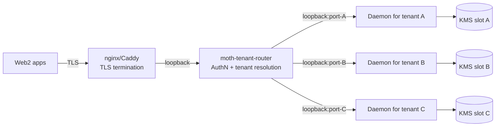

# 08 — Multi-Tenant Roadmap

Stage 4 — the daemon serves many independent wallets owned by independent end-users, with the operator acting as either a custodian (holding the keys) or a wallet-manager (signing for keys the users hold). This section sketches the shape; concrete decisions land as ADRs when the work starts.

## Two models

Two genuinely different products live behind "multi-tenant":

| Property | A. Custodial | B. Wallet-manager (self-custodial-multi-user) |
|---|---|---|
| Who holds the seed | Operator (in KMS/HSM) | User's own wallet / KMS / hardware |
| What the daemon does | Unlocks user's seed on each request, signs, submits | Receives a pre-signed payload + auxiliary data, performs the rest of the pipeline |
| AuthN at the daemon | API key (stage 2) + user's identity | API key + signature over each op binding to the user's pubkey |
| Recovery on lost user creds | Custodian can recover via KYC | User must use their own recovery; daemon cannot help |
| Regulatory surface | Full custody (BSA, MiCA, travel rule depending on jurisdiction) | Closer to a tx broker; lighter regime |
| Failure mode of operator compromise | Catastrophic — all keys at the custodian's KMS leak | Bounded — operator can replay user requests but can't forge new ones (signature required) |

The roadmap below addresses the **custodial** model. The wallet-manager model is a separate spec branch; see Open Questions.

## D-ARCH-2 still holds: one daemon per wallet

The architecture-level decision in [01](./01-architecture.md#d-arch-2) — one daemon process per wallet — extends to stage 4 unchanged. Multi-tenant doesn't mean "one daemon for everyone." It means:

- A **tenant router** (separate process) terminates inbound TLS + AuthN, looks at the `apiKeyId` / JWT audience claim, and forwards the request to the correct backend daemon.
- Each tenant has their own dedicated daemon process, each with their own `~/.moth/`-like state directory, each bound to their own loopback port on the router's host.
- Cross-tenant operations are impossible at the protocol layer — the router never sends a frame to the wrong daemon.

Why one-daemon-per-tenant survives:

- **Blast radius**: a memory bug in the daemon leaks one tenant's keys, not every tenant's.
- **Sync isolation**: one tenant's expensive deploy doesn't queue behind another tenant's transfers (D-ARCH-2's serialisation is per-process).
- **Per-tenant policy / audit**: filesystem layout already separates tenants; no shared mutable state.
- **Scaling**: process-per-tenant is heavier than thread-per-tenant in nominal RAM, but each daemon's resident set is ~50–100 MB; a host with 64 GB serves ~600 tenants comfortably.

## Tenant router

A new component, `moth-tenant-router` (working name). Sits between the public TCP/TLS endpoint and the per-tenant daemons. Responsibilities:

1. **TLS termination + AuthN** — the proxy from stage 3 ([04](./04-approval-pipeline.md) → reverse proxy). Validates the bearer token / JWT.
2. **Tenant resolution** — maps the authenticated identity to a tenant id, then to the backend daemon's loopback port. The mapping lives in a small operator-managed config (per-tenant entry: id, daemon-port, allowed-API-key-ids).
3. **Frame forwarding** — opens a backend connection (per-frontend-connection, no pooling at stage 4 — keep it simple), forwards every length-prefixed JSON frame in both directions. Does NOT parse the JSON beyond enough to enforce the tenant binding.
4. **Per-tenant rate limiting** — token-bucket per `(tenantId, verb-class)`. Frontend-visible — separate from the daemon's per-wallet mutex.
5. **Routing audit log** — separate from per-daemon audit. Captures `(timestamp, tenantId, apiKeyId, verb, status, latency-bucket)`. No payload; the backend daemon's audit log has that.

The router is process-per-host, not process-per-tenant. One router fronts N daemons.

## Key custody (custodial model)

[05-key-management.md](./05-key-management.md) D-KM-5 sketches the direction: keys move out of the daemon's RAM into a KMS / HSM / TEE. Concretely at stage 4:

- Each tenant's seed is generated inside the KMS at provisioning. The plaintext seed never exists on disk or in daemon memory.
- The daemon's `WalletKeys` bundle is replaced by a `KmsBoundKeys` shim that delegates signing operations to the KMS. The shim exposes the same interface so the rest of the daemon doesn't change.
- The KMS enforces its own policy (rate limits, allow-list of source IPs, per-key audit). The daemon trusts the KMS implicitly for AuthN of the daemon-to-KMS hop; the operator's IAM ensures only this daemon can call this KMS slot.

Recovery without KMS access (operator catastrophe): a sharded backup of each tenant's seed protected by N-of-M operator passphrases. Three-of-five Shamir Secret Sharing is the canonical choice. Backups live offline.

## Tenant onboarding

Default flow:

1. End-user signs up on the Web2 app fronting the operator.
2. The Web2 app calls a `tenant.provision` admin RPC on the router (separate scope, separate credentials).
3. Router asks the operator's KMS to generate a new key, stores the resulting wallet address + KMS slot reference in the tenant registry.
4. Router spawns a new daemon process bound to a free loopback port, configured to use that KMS slot.
5. Router returns the wallet address + a freshly-generated API key (read+write scopes) to the Web2 app.

Tenant offboarding is the reverse: revoke the key, stop the daemon, archive the tenant's audit log, optionally zero the KMS slot after the regulatory retention period.

## Quotas and billing

Quotas live in the router (per-tenant rate limits) and the daemon's policy engine (per-key spend caps, per-day aggregates — see [03](./03-authorization-policy.md)). Billing is a downstream concern that consumes the router's audit log:

- Per-tx meter: count `submitTransaction`-class verbs per tenant per day.
- Per-deploy meter: separately, deploy + maintenance carry weight differently.
- Storage meter: size of audit log + level-db state per tenant per day.

The daemon doesn't run billing logic; the operator pulls metrics from the router + per-tenant audit files into their own billing pipeline.

## Compliance touchpoints

Custodial operation is regulated in most jurisdictions. The spec doesn't substitute for legal advice but anchors the daemon's design where compliance hooks need to attach:

- **Travel rule (FATF Rec 16)**: outbound transfers above a threshold must carry originator/beneficiary info. The daemon's `transferTokens` verb has no place for it today; stage 4 adds an optional `originatorInfo / beneficiaryInfo` block in the params, and the policy engine refuses transfers without it when the destination is a known VASP.
- **KYC binding**: each tenant id maps to a KYC record in the operator's identity store. The daemon doesn't see KYC data — it just trusts the tenant id from the router.
- **Audit retention**: regulators require N years of retention. Per-tenant audit logs are rotated daily today (stage-1.5); stage 4 ships them to an external append-only store (object storage with object-lock, or a SIEM) with the retention horizon set per jurisdiction.
- **Sanctions screening**: outbound transfer destinations must be checked against OFAC + jurisdiction-specific lists. Policy-engine concern; the daemon's allowlist primitive can encode the result of a screen ("allowed because we checked at sign-up").
- **Reporting**: SAR/STR filing happens at the operator's compliance layer, not the daemon. The daemon's audit log is the source of truth for the reporter's queries.

## Recovery: lost user credentials

Custodial deployments must answer "user lost their API key — what now?" The operator's flow:

1. User contacts support, re-verifies KYC.
2. Support staff (separate role, separate credentials) revokes the lost key via `moth daemon key revoke` and issues a new one.
3. The action is logged in the audit trail with the staff member's id, the reason, and the timing. The audit trail itself is what guards against malicious-insider recovery — multi-person review of key-recovery events is a procedural control.

For an operator-catastrophic loss (their entire host gone), the Shamir-sharded backup from "Key custody" above is the path. Slow, expensive, only used in true emergencies.

## Migration from single-tenant to multi-tenant

An operator who started single-tenant (stage 1–3) and grows into multi-tenant doesn't have to throw away their daemon:

1. Spin up the router on the same host.
2. Bind each existing daemon's loopback port to a tenant id in the router config.
3. Update consumers to talk to the router instead of the daemon directly.
4. Migrate keys to the KMS at leisure (D-KM-5 transition; D-KM-3 already proved this is decoupled from the daemon code path).

The protocol is identical at every step. The router speaks the same length-prefixed JSON frames the daemon does; existing client code keeps working.

## Open questions

- **Wallet-manager (self-custodial-multi-user) variant**: a different product entirely. The user holds the seed; the daemon gets pre-signed payloads + supporting data. Closer to a tx broker than a custodian. The threat model and regulatory regime are both different. Worth its own spec branch when there's a use case asking for it.
- **Corporate treasury with multi-approver semantics**: one wallet, multiple human approvers, M-of-N for spends. Folds into stage-3 approval pipeline (M-of-N in [04](./04-approval-pipeline.md)) more than stage-4 multi-tenant — it's not really "multi-tenant" in the wallet-isolation sense. Worth flagging here so a future reader doesn't conflate the two.
- **Cross-tenant atomic operations**: deliberately rejected. If tenant A wants to pay tenant B, both go through the chain; no shortcut. The daemon never participates in atomic ops involving multiple tenants. Simpler isolation, simpler audit, simpler regulation.
- **Tenant-scoped indexer / proof server**: at scale, sharing one indexer + proof server across thousands of tenants creates a single point of compromise (the proof server in particular sees witness data — [09](./09-threat-model.md) tracks this). At very high scale, per-tenant proof servers in TEEs become attractive. Far enough out that we don't need to design it now.
- **Tenant migration between hosts**: at scale, a tenant's daemon might need to move to a different host (resource rebalancing, failover). The serializable state is small (keystore + audit log); the moving part is the KMS slot's IAM policy. Operationally tractable, but worth a runbook before stage 4 production.
