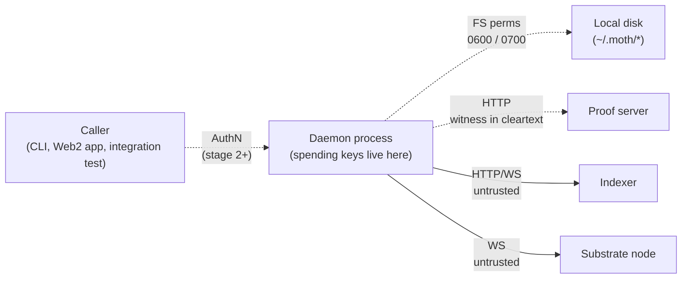

# 09 — Threat Model

What we're defending against, what we're not, and where the soft edges are. STRIDE-style pass per component, per deployment stage. Each row pairs the adversary capability with the daemon's response and the residual risk.

## Trust boundaries

Five components, four trust boundaries:

The dotted boundaries are the ones we actively defend. The solid ones (indexer, node) are mutually untrusted public infrastructure — defended at the protocol level by Midnight itself, not by the daemon.

## STRIDE matrix

### Spoofing

| Adversary | Stage 1 (Unix) | Stage 2 (TCP + AuthN) | Stage 3 (TLS + mTLS) | Stage 4 (router + KMS) |
|---|---|---|---|---|
| Other UID claims to be the operator | Blocked: kernel UID check on the socket file (0600 in 0700 dir) | Same | Same | Same |
| Network attacker presents a token | n/a (no network exposure) | Must produce a valid `<id>.<secret>` token. SHA-256 + timingSafeEqual; 32-byte secret entropy = ~256 bits, brute force infeasible | Same; mTLS adds cert-chain verification | Same; JWT audience claim ties identity to tenant |
| Operator impersonates an end-user | n/a (single-tenant) | n/a | n/a | Audit log + multi-person approval for sensitive ops bound this risk to "operator misuse" rather than "spoofing", but a malicious operator with KMS access is catastrophic — see Insider Threats below |
| The daemon impersonates itself to a new connection | Client verifies `version` handshake's `protocol` field on every connect; mismatch returns null | Same | TLS cert binding adds a second layer | Tenant router enforces that the backend daemon's loopback port matches the resolved tenant — no daemon can serve frames it wasn't bound to |

**Residual risk**: same-UID spoofing (a malicious VSCode extension running as the operator) bypasses every check on this row. Mitigation lives in [05 — Key Management](./05-key-management.md) D-KM-3 (derive-and-drop) and D-KM-5 (KMS offload).

### Tampering

| Target | Stage 1 | Stage 2 | Stage 3+ |
|---|---|---|---|
| Keystore file | 0600 perms; AES-256-GCM detects modification at decrypt time | Same | Same |
| Audit log | 0600 append-only; root can overwrite silently. Tamper detection deferred. | Same | Hash-chain (Trillian-style) lands at stage 3+ — see [06](./06-audit-observability.md) |
| API key records | 0600 perms; modification → next verify mismatches the hash → auth rejects | Same | Same |
| Sync cache (.dat files) | 0600; tamper breaks the SDK's serialised state → next sync starts fresh | Same | Same |
| Policy file | 0600 perms; reload (stage 3) re-reads from disk, so an attacker with root can quietly broaden allowances | Same | Hash-chain the policy file alongside the audit log; reload-event includes a content hash so an external monitor can detect drift |
| Protocol frames in flight | n/a (kernel socket, never on wire) | Plaintext on loopback TCP; trusted-host model | Wire-encrypted by the reverse proxy; tampering detected by TLS MAC |

**Residual risk**: an attacker with root can rewrite history in the audit log on stage 1–2. Acceptable for the developer-laptop case. Becomes unacceptable the moment the operator commits to "audit log is forensically authoritative."

### Repudiation

A caller wants to deny they made an RPC the daemon performed.

| Claim | Defence |
|---|---|
| "I never sent that transfer" — caller denies the RPC | Audit log records `apiKeyId` + `connId` + `summary` + `txHash`. The caller possessing the API key proves they (or someone with their key) made the call. |
| "The daemon misattributed me" | Stage 1–2: the audit log is internal — no external proof. Stage 3+: hash-chained log + per-tenant log replication to an external append-only store give a third-party-verifiable record. |
| "My key was leaked, the request wasn't really me" | Revocation procedure ([02](./02-authentication.md)) handles future ops; past ones stand. The caller's incident response is the recovery path. |

**Residual risk**: stage 1–2 has no out-of-band attestation of the audit log. A malicious operator can credibly deny a caller's authentic op, or fabricate one the caller didn't make. Hash-chaining + external mirror at stage 3 closes this for new entries; old entries stay trust-the-operator.

### Information disclosure

What leaks from where:

| Source | Leak content | Mitigation |
|---|---|---|
| Process memory dump (gcore, /proc/$PID/mem, macOS task_for_pid) | BIP-39 seed prior to D-KM-3; only the typed `WalletKeys` bundle post D-KM-3 | D-KM-3 implemented; D-KM-4 (`mlock`) planned. KMS offload (D-KM-5) eliminates plaintext keys entirely. |
| Process memory dump | API keys' wire tokens for in-flight RPCs | Tokens live in memory only during the auth handshake; daemon stores only the salted hash. Compromise is bounded to the auth window. |
| Process memory dump | Witness data during proof generation | This data is the wallet's private state; leaks defeat the privacy guarantees Midnight gives users. Most exposed surface today. Mitigated by D-KM-3 (witnesses derive from `WalletKeys` per call, not held across the daemon's lifetime). |
| Core dump on crash | Same as process memory | Disable core dumps for the daemon process (`ulimit -c 0` in the systemd unit). Mandatory in stage-3 deployment. |
| Swap file | Any of the above, if pages were swapped | On macOS, swap is encrypted by default (mitigates). On Linux, depends on operator config. `mlock` (D-KM-4) pins the critical pages. |
| Audit log file | Operator-meaningful summaries (recipient addrs, tx hashes, contract addrs). NOT seeds, NOT witnesses, NOT API key secrets. | 0600 perms. Anyone with read access has approximately the same view as the operator running `moth wallet list -o json`. |
| `~/.moth/api-keys/<id>.key` | Salted SHA-256 hash of the secret; no plaintext, no recoverable form. | High-entropy secret makes brute force infeasible. |
| Backup tape | Same as the on-disk state | Operator's backup policy is their concern; the daemon's only contribution is "the keystore is encrypted at rest." |
| Proof server | Witness data in cleartext during proof generation | **Largest open exposure.** The proof server sees the witness payload because it has to construct the ZK proof. A hostile or compromised proof server learns the wallet's private state. Stage-4 mitigation: per-tenant proof servers inside a TEE. Stage 1–3: trust the proof server, run it on the operator's own host. |
| Indexer | Public chain state + this wallet's subscription stream | The indexer is public-chain infrastructure. It cannot disclose anything that isn't already on-chain. |

**Residual risk**: the proof server is the most attractive target in the current architecture. A network adversary who compromises the proof server learns every witness the daemon sends through it — which is essentially the wallet's spending history with full UTXO context. Same-host proof server running as the daemon's UID minimises this; treating the proof server as untrusted is the long-term direction.

### Denial of service

| Attack | Effect | Defence |
|---|---|---|
| Burn the wallet's DUST by spamming on-chain ops the daemon will reject | Wallet runs out of DUST, can't pay fees, every write op fails | Per-key spend caps at stage 3 ([03](./03-authorization-policy.md)) bound the rate. Stage 1–2: trust the operator's automation. |
| Pin the daemon's socket open (TCP, ESTABLISHED but idle) | Future connections queue / refused | TCP keep-alive (TODO; tracked in [07](./07-failure-modes.md)). Per-IP rate limit at the reverse proxy in stage 3+. |
| Spam the proof server with non-finalising proofs | Proof server queue fills; legit ops time out | Proof server's own concurrency limit + the daemon's per-wallet mutex (one prove at a time per wallet). |
| Flood the daemon with `auth` attempts | Per-attempt cost: one SHA-256 + a few syscalls. Cheap to absorb. | Rate limit at the proxy. The hash is fast enough that even uncapped, a single host's CPU absorbs millions of attempts/sec without slowing other ops. |
| Flood the daemon with valid but unauthorised requests | Each rejected request burns a frame parse + a hash check + an audit-log line | Same proxy rate limit. The audit log size grows; operators watch disk via standard monitoring. |
| Submit huge frames to exhaust memory | Daemon caps at 16 MiB per frame; over-cap returns INVALID_REQUEST + closes the connection | Hard limit in the FrameDecoder; non-configurable. |
| Hold a connection without sending data | Frame decoder buffers up to one frame's worth; idle connections don't accumulate state | Per-connection idle timeout (TODO; the kernel keep-alive defaults are too slow). |

**Residual risk**: stage 1–2 has minimal rate limiting (none on the Unix socket; the trust model says you don't need it). Stage 2 TCP without a reverse proxy is exposed to connection-storm DoS; the operator should put a proxy in front.

### Elevation of privilege

| From | To | Defence |
|---|---|---|
| Unauthenticated TCP connection | Any RPC | Server gate refuses every non-`version`/non-`auth` method on connections with no `apiKeyId`. |
| `read`-scope key | `write` verbs | Per-method gate checks the handler's `.scope` against `ctx.scopes`; mismatch → UNAUTHORIZED. |
| `write`-scope key | Approval-system bypass (stage 3+) | `approve` scope is separate; a write key cannot self-approve its own gray-zone request. Defense-in-depth against compromised write keys triggering escalations against themselves. |
| Daemon process | Operator UID (other files in `~`) | Daemon runs as the operator; no process-level isolation today. systemd hardening directives at stage 2+ (`NoNewPrivileges=yes`, `PrivateTmp=yes`, etc.) bound this. |
| Daemon process | Root | Daemon never runs as root. Operator MUST NOT run it as root; the README + systemd unit reference repeat this. |
| Daemon process | Other tenant's daemon (stage 4) | One daemon per tenant ([08](./08-multi-tenant-roadmap.md) D-ARCH-2). A compromised daemon can only access its own tenant's keys. Cross-tenant escape requires escaping the daemon's process boundary too. |

**Residual risk**: stage 1–3 deployments run the daemon as the same UID as the operator's general-purpose shell. A compromise of that UID (rogue npm install, VSCode extension) is total. Operators who care should isolate the daemon to its own UID with restricted shell access; that's an operator hardening guide, not a daemon design decision.

## Specific adversary scenarios

### Same-UID malware

The operator runs the daemon as their own UID. Their VSCode installs an extension that turns out to be malicious. The extension:

- Reads `~/.moth/wallets/<name>.keystore` — gets ciphertext, useless without the passphrase.
- Reads `~/.moth/api-keys/*.key` — gets the hashes, useless without the plaintext secrets.
- Attaches `ptrace` to the daemon — extracts every typed key in `WalletKeys`, can sign transactions directly against the chain (bypassing the daemon entirely).
- Reads `~/.moth/daemon-audit.log` — sees operator history.

**The daemon cannot defend against same-UID malware.** Defense moves to:
- D-KM-5: keys leave the daemon entirely (KMS / HSM); same-UID malware can issue signing requests but cannot exfiltrate keys.
- Operator-side hardening: separate UID for the daemon, code-signing on extensions, etc.

This is the loudest unmitigated risk in stages 1–3.

### Network adversary on the wire

- Stage 1: irrelevant (no wire).
- Stage 2 loopback TCP: irrelevant if the loopback bind is the only TCP path. If the operator binds 0.0.0.0 (we refuse this without an explicit override) — plaintext on the LAN.
- Stage 3 reverse-proxy TLS: TLS terminates at the proxy, plaintext between proxy and daemon over loopback. Adequate when proxy + daemon share a host.
- Stage 3 with the daemon on a different host than the proxy: needs TLS or mTLS on the proxy-to-daemon hop too. Out of scope today; document if it becomes a deployment shape.

### Rogue operator insider (multi-tenant)

Custodial stage 4. An operator engineer with KMS access can sign any tenant's tx without that tenant's API key.

Defences:
- KMS-side IAM: signing requires multi-person approval at the KMS layer (e.g. AWS KMS with `kms:Sign` gated by a multi-party policy).
- Audit log + external mirror: every signing operation is recorded immutably; rogue signing eventually shows up in periodic review.
- Per-tenant audit log replication to a third-party store the operator cannot rewrite.

The protocol-level threat-model says "trusted operator." Compliance frameworks (BSA, MiCA) require operational controls beyond what the daemon can enforce; this section flags the boundary, doesn't try to invent one.

### Compromised dependency

The npm supply chain. An attacker publishes a malicious version of a transitive dep (effect, @midnight-ntwrk/*, anything in the dependency closure). The daemon imports it on startup. Game over.

Defences are independent of the daemon's design:
- Lockfile checks at install time.
- Yarn `--immutable` in CI.
- Per-release SBOM + diffing.
- Restricted scopes for transitive deps via npm `overrides`.

Recommended operator practice: pin every direct dependency, audit the closure, monitor `npm audit` and Dependabot signals. The daemon does not paper over this — it can't.

### Compromised proof server

The proof server sees witness data in cleartext during proof generation. If it's compromised:

- It learns the wallet's spending pattern (which UTXOs were used, which weren't).
- It can refuse to prove, denying service.
- It cannot sign or submit — it only constructs ZK proofs, doesn't hold the spending keys.
- It cannot forge a proof for a different witness; the proof is bound to the witness data the daemon provided.

**Worst-case**: an attacker who controls the proof server learns the wallet's complete private spending history while the daemon was using that proof server. They cannot make the wallet spend; they can deny service.

Mitigation today: run the proof server on the operator's own host, behind the same trust boundary as the daemon itself. Future (stage 4+): per-tenant proof server in a TEE, bound to the daemon via remote attestation.

### Compromised indexer

The indexer is public-chain infrastructure. A compromised indexer can:
- Lie about the wallet's UTXOs (omit some, fabricate others).
- Lie about chain height / sync progress.
- Cannot spend the wallet.
- Cannot forge a tx; the daemon would build an invalid one off the bad data, and the node would reject it.

Defence: run an indexer the operator trusts. The daemon doesn't verify the indexer's claims independently — that would mean running a full node, which defeats the purpose of having an indexer.

### Compromised node

The substrate node is also public-chain infrastructure. A compromised node can:
- Drop the daemon's submitted txs (DoS).
- Lie about block headers / finality.
- Cannot spend the wallet (no spending key).
- Cannot affect the chain's actual state (other nodes will reject its lies).

Defence: trust the standard substrate-node deployment, or run an in-house node. Same shape as the indexer threat.

## Open questions

- **Midnight protocol privacy interaction**: does running a custodial daemon weaken the user's privacy guarantees? Yes, materially — the custodian sees every spend. Some users will choose self-custody for that reason. The wallet-manager (self-custodial-multi-user) variant from [08](./08-multi-tenant-roadmap.md) is the answer for users who want privacy + a managed signing service. Out of scope for the custodial spec; flagged so we don't pretend custody is privacy-neutral.
- **Formal modelling**: would Tamarin / ProVerif of the auth + approval protocols catch anything the design review missed? Probably; whether the investment is worth it depends on deployment scale. Park until a real custodial deployment is on the table.
- **TEE for the daemon itself**: SEV / TDX / Apple Secure Enclave for the entire daemon process eliminates the same-UID-malware risk. Operationally hard (key provisioning, attestation, debugging in production). Worth scoping when the threat warrants it.
- **Side channels at the proof server**: timing-based info leakage from the prove pipeline. Probably exploitable for shielded-vs-unshielded inference even if the witnesses themselves don't leak. Lives at the SDK / proof server layer; flag it here for completeness.
- **DoS via expensive verbs**: a single `deployContract` ties up the wallet's mutex for minutes (proof + finalisation). Combined with the per-wallet serialisation policy, an attacker with a valid write-scope key can grind the wallet to a halt. Stage 3 per-key concurrency limits + tx-cost-weighted rate limits.
