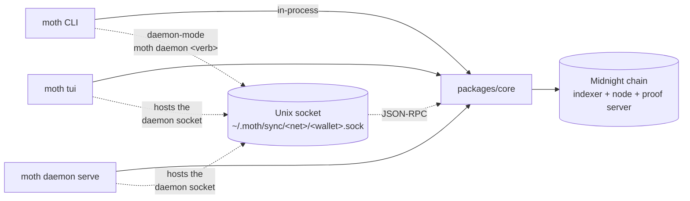
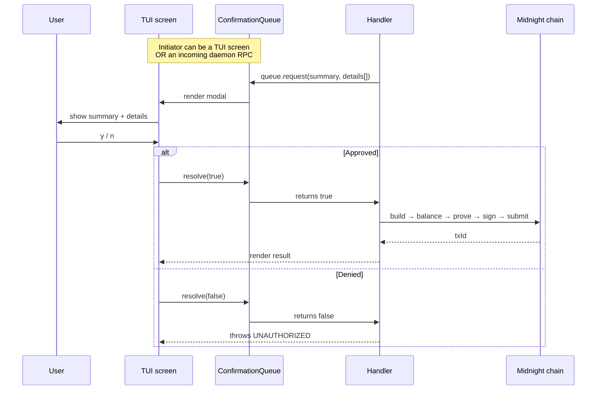
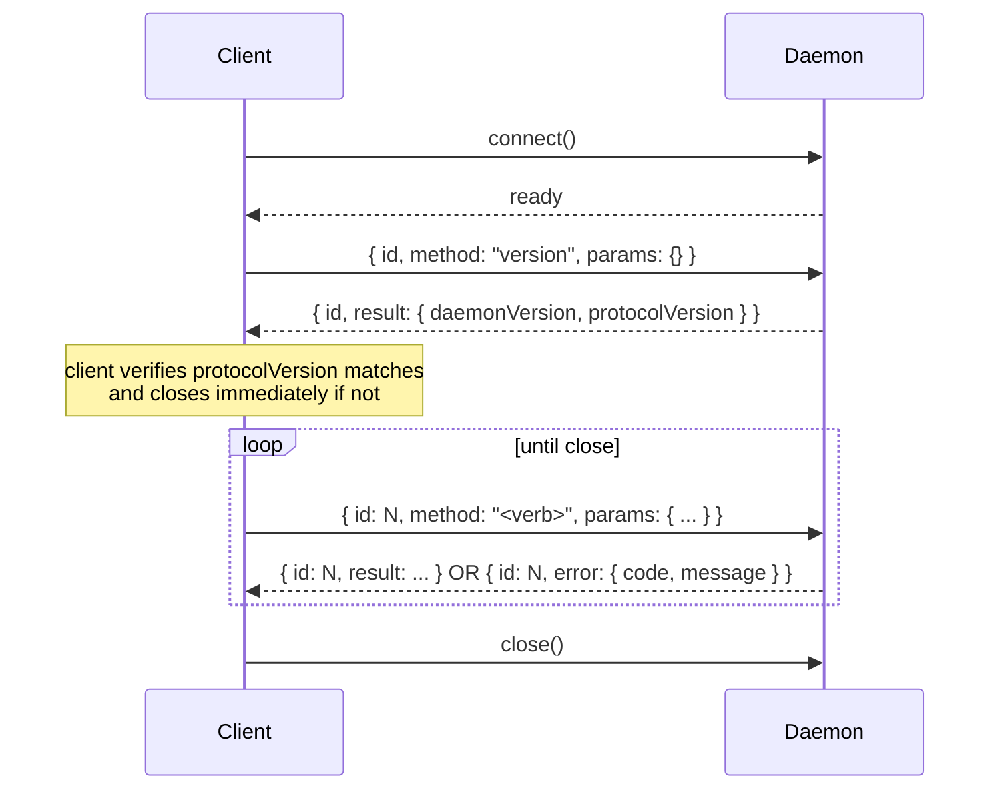
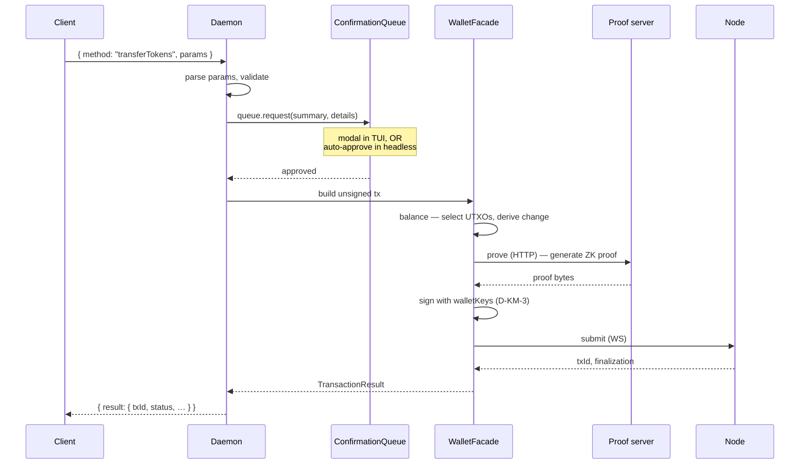

# Commands Reference

Comprehensive reference for everything Moth exposes — CLI commands, TUI keybindings, and the daemon RPC verbs that back service-mode deployments.

> Three runtimes, one core. The CLI, TUI, and daemon RPC are thin shells around the shared `packages/core` engine. A command name appearing in all three columns means it routes through the same handler code; the surface is just dressed differently per shell.

## Overview



The CLI runs in two modes:

- **In-process** — `moth transfer`, `moth deploy`, etc. unlock the wallet, start a one-shot sync, do the operation, exit. Simple, single-shot, no shared state.
- **Daemon-mode** — `moth daemon transfer`, `moth daemon deploy`, etc. connect to a daemon socket and ask it to do the work. The daemon is hosted by either `moth tui` (interactive) or `moth daemon serve` (headless). Sync is warm, signing keys never leave the daemon process, every write op triggers an L3 confirmation modal in the TUI (or auto-approves in headless mode).

---

## CLI Reference

### Global flags

Every command accepts these. Defaults shown.

| Flag | Short | Default | Purpose |
|---|---|---|---|
| `--output` | `-o` | `text` | `text` or `json` |
| `--network` | `-n` | `devnet` | One of `devnet`, `preview`, `preprod`, `qanet`, `undeployed`. `undeployed` is the local devnet stack (node on `9944`, indexer on `8088`). Not restricted to that list — endpoints are overridable, so a custom id is a valid target and gets the localhost defaults. `local` was an earlier name for `undeployed` and still resolves to it. `mainnet` parses but every command refuses it: Moth is unaudited and not for real funds. |
| `--wallet` | `-w` | active | Wallet name from `~/.moth/wallets/` |
| `--verbose` | `-v` | off | Debug output to stderr |
| `--timeout` | `-t` | varies | Per-op timeout (seconds) |
| `--proof-server` | | config | Override proof-server URL |
| `--indexer` | | config | Override indexer GraphQL URL (env: `MOTH_INDEXER_URL`) |
| `--node-url` | | config | Override node WS URL (env: `MOTH_NODE_URL`) |

### Wallet management

| Command | Purpose |
|---|---|
| `moth wallet generate [--name <n>]` | Generate a new wallet from a random BIP-39 mnemonic. Prompts (or reads `MOTH_PASSPHRASE`) for the passphrase that encrypts the keystore at rest. |
| `moth wallet import [--name <n>]` | Import from a recovery phrase (stdin or interactive) or `--seed-hex`. |
| `moth wallet list` | List all configured wallets in `~/.moth/wallets/`. |
| `moth wallet address --name <n>` | Print a wallet's receive addresses — NIGHT external, DUST, and shielded (zswap) — for every network. Unlocks the keystore but runs fully offline (no sync). |
| `moth wallet use [<name>]` | Switch the active wallet. |
| `moth wallet remove [<name>] [--yes]` | Delete a wallet. Requires `--yes` for non-interactive use. See [Wallet lifecycle](#wallet-lifecycle) below for what this touches on disk. |
| `moth wallet resync [--dust-only] [--yes]` | Discard the wallet's cached sync state so the next command rebuilds it from the chain. For a cache that has gone wrong in a way a restart cannot fix — a doubled balance, or a coin the wallet refuses to spend. Costs a full rescan; `--dust-only` keeps the larger shielded and unshielded caches. |
| `moth wallet status` | Daemon-mode read verb. Returns sync progress + balances from the running TUI / `daemon serve`. Fast — no resync. Errors out if no daemon is hosting the named wallet. |

### Wallet lifecycle

A wallet has more on-disk state than just the keystore. Knowing what each operation creates and tears down matters because **regenerating a wallet under the same name will silently inherit any state that wasn't cleaned up** — a real footgun the daemon hit during integration test bring-up.

#### What `moth wallet generate` creates

| Path | Owned by | Purpose |
|---|---|---|
| `~/.moth/wallets/<name>.keystore` | `WalletManager` | AES-256-GCM encrypted BIP-39 mnemonic (hex-imported wallets store `seed:<hex>`). Key derived from the operator's passphrase via scrypt (version-specific parameters). Mode `0600`. |
| `~/.moth/wallets/<name>.meta` | `WalletManager` | Unencrypted JSON: `{ name, network, createdAt, address?, birthday?, label? }`. `address` is the public bech32m NIGHT receive address (safe in the clear — it lets `wallet list` show an address without unlocking). Mode `0600`. |
| `~/.moth/config.json` | `WalletManager` | Updated in place — adds the wallet name and (if it's the first) sets it active. Mode `0600`. |

Nothing else is created at generate time. Sync caches, level-db state, and the daemon socket only show up when the wallet is actually used.

#### What `moth daemon serve` / `moth tui` create (on first sync)

| Path | Created on first | Why |
|---|---|---|
| `~/.moth/sync/<network>/<name>/shielded.dat` | First shielded sync update | Serialized Zswap wallet state — the `appliedIndex` cursor + UTXO accounting. |
| `~/.moth/sync/<network>/<name>/unshielded.dat` | First unshielded sync update | NIGHT UTXO ledger view. |
| `~/.moth/sync/<network>/<name>/dust.dat` | First DUST observation | DUST coins + generation rates. |
| `~/.moth/sync/<network>/<name>.sock` | Daemon socket bind | Unix domain socket, mode `0600`. Removed automatically on clean shutdown; can be stale after a crash. |
| `~/.moth/level-db/<network>/<encPublicKey-prefix>/` | First `moth deploy` / `moth daemon deploy` | LevelDB store for the SDK's contract private state. Directory name is the **first 16 chars of the wallet's encryption pubkey**, not the wallet name — so re-creating a wallet with the same name but a different seed leaves the old level-db orphaned but doesn't collide. |
| `~/.moth/empty-ref/<network>/` | First pre-seed run for that network | Shared reference wallet's sync state, used to fast-start new wallets. Not per-wallet; survives `wallet remove`. |
| `~/.moth/daemon-audit.log` | First daemon write op | Append-only JSONL audit log. Every RPC's verb / summary / decision / outcome and every daemon lifecycle event lands here. Daily rotation to `daemon-audit.log.YYYY-MM-DD`. See [06](./06-audit-observability.md). |
| `~/.moth/api-keys/<id>.key` | `moth daemon key gen` | One JSON record per API key (id, label, salt, hashedSecret, createdAt, optional revokedAt). Mode `0600` in a `0700` dir. Plaintext secret is never persisted — recovery requires regenerating. See [02](./02-authentication.md). |

#### What `moth wallet remove` deletes

As of `feat/tui-daemon`'s `removeWalletSyncArtifacts` integration:

| Path | Removed? | Notes |
|---|---|---|
| `~/.moth/wallets/<name>.keystore` | ✓ | Keys are unrecoverable from this point. |
| `~/.moth/wallets/<name>.meta` | ✓ | |
| `~/.moth/config.json` entry | ✓ | If this was the active wallet, active flips to another wallet (or `null`). |
| `~/.moth/sync/<network>/<name>/` (recursive) | ✓ | All three `.dat` files + the directory itself. |
| `~/.moth/sync/<network>/<name>.sock` | ✓ | Best-effort; ignored if already cleaned by the daemon's shutdown. |
| `~/.moth/level-db/<network>/<encPub>/` | ✗ | Cannot be derived without the keystore (chicken-and-egg). Lingers as orphaned bytes — safe because the directory is keyed by encryption pubkey, so a re-create with the same name won't collide. |
| `~/.moth/empty-ref/<network>/` | ✗ | Shared across all wallets on that network; surviving is correct. |
| `~/.moth/daemon-audit.log` | ✗ | Audit log is intentionally retained; survives the wallet it audited. |

#### Practical implications

- **Regenerating with the same name is now safe.** The old sync cache is removed, so the new wallet will sync from scratch (or from the empty-ref pre-seed). Pre-fix, this was a real source of confusing test failures during 2026-06-22 integration bring-up.
- **A crashed daemon may leave a `.sock` file behind.** Run `wallet remove` (which best-effort cleans it) or just remove the file manually before re-launching the daemon.
- **`level-db/` will accumulate orphans over many wallet generations.** Not a security issue, just disk usage. A separate `moth maintenance prune-level-db` command would address this if it becomes a real footprint problem.
- **Audit log persists past wallet removal.** Operationally desirable (you can still answer "what did wallet X do before it was removed?") but worth noting if that's a privacy concern in a particular deployment.

### In-process operations

These spin up their own sync, do the op, and exit. Use for one-shot work or when no daemon is running.

| Command | Purpose |
|---|---|
| `moth balance` | Show NIGHT (shielded + unshielded) + DUST + any non-NIGHT token balances. Spins up its own sync; use `moth wallet status` instead when a daemon is already running for this wallet (instant; reads from the daemon's warm snapshot). |
| `moth transfer <amount> NIGHT --to <addr> [--shielded]` | Send NIGHT. `--shielded` routes through Zswap. |
| `moth transfer batch <file.json>` | Batch transfer from a JSON manifest. Exit: 0 all ok / 1 partial / 2 all failed. |
| `moth deploy <artifact> [--witnesses <f>] [--project-dir <dir>]` | Deploy a compiled Compact contract. `--project-dir` is the SDK-resolution root (see [01-architecture.md §5](./01-architecture.md) for why this matters). |
| `moth call <circuit> --address <addr> [--args <json>]` | Call a circuit on a deployed contract. `--args` accepts inline JSON or `@file.json`. |
| `moth state <address>` | Query public ledger state for a contract. |
| `moth mint <amount> --address <addr>` | Mint fungible tokens on a deployed contract. |
| `moth dust register` | Register all unregistered NIGHT UTXOs for DUST generation. |
| `moth dust deregister` | Reverse — registered NIGHT stops generating DUST. |
| `moth dust status` | Show DUST generation rate and capacity. |
| `moth maintenance insert-vk --address <addr> --circuit-id <name> --vk-file <path>` | Maintenance update: add a verifier key for a previously-undefined circuit on a deployed contract. Used to stage-deploy contracts whose total VK payload exceeds the per-tx block weight cap. |
| `moth maintenance insert-vks-batch --address <addr> --artifact <dir>` | Bulk variant. Shares one wallet sync across many submits; one tx per VK because the maintenance authority counter is monotonic. `--skip-existing` makes it resumable. |
| `moth airdrop` | **Stub** — see [01-architecture.md §5](./01-architecture.md) and [README](../../../README.md). Real funding on `undeployed` is `npx midnight-wallet-cli midnight airdrop <amt> --wallet <bech32m>`. |
| `moth info` | Network and node status. |
| `moth config get/set <key> [<value>]` | Read/write a config value stored at `~/.moth/config/<key>`. Valid keys: `default-network`, `prover`, `proof-server-url`, `node-url`, `indexer-url`, `check-matrix`, `matrix-url`. (There is no `unset` — only `get` and `set`.) |
| `moth tui` | Launch the interactive dashboard (also hosts the daemon). |

### Daemon-mode operations

These connect to a running daemon socket. The daemon does the build/balance/prove/sign/submit pipeline; spending keys never leave the daemon process.

| Command | Purpose |
|---|---|
| `moth daemon serve --wallet <n> --network <net> --auto-approve [--transport unix\|tcp] [--bind <host>:<port>]` | Start a headless daemon. Requires both `--auto-approve` and `MOTH_DAEMON_AUTO_APPROVE=1` to acknowledge that L3 modal consent is automated. Default transport is `unix` — binds `~/.moth/sync/<net>/<wallet>.sock` (mode 0600 in a 0700 dir). `--transport tcp --bind <host>:<port>` binds TCP (loopback only — 127.0.0.1/::1/localhost; a non-loopback host is refused because the transport is unencrypted, so front it with a TLS-terminating reverse proxy) and requires at least one active API key in `~/.moth/api-keys/`; otherwise the daemon refuses to start. Requires the token via `MOTH_DAEMON_TOKEN` and a `--max-spend <NIGHT>` per-tx cap. |
| `moth daemon key gen --label "<purpose>" [--scopes read\|write\|read,write]` | Generate a new API key. Prints the `<id>.<secret>` token on stdout **once** — capture it now; the daemon stores only a hash and the plaintext is unrecoverable. `--scopes` defaults to `write` (full access); `read` allows only `getState`. |
| `moth daemon key list` | List all keys (id, label, scopes, createdAt, revoked-or-active). Never shows the plaintext. |
| `moth daemon key revoke <id>` | Stamp `revokedAt` on the record. Audit history still references the id; future auth attempts with that token fail. |
| `moth daemon transfer --to <addr> --night <amt>` | Transfer NIGHT through the daemon. Triggers L3 modal (or auto-approve audit log). |
| `moth daemon call <circuit> --address <addr> --artifact <dir> [--witnesses <f>] [--project-dir <dir>]` | Call a circuit through the daemon. |
| `moth daemon deploy <artifact> [--witnesses <f>] [--project-dir <dir>]` | Deploy a contract through the daemon. |
| `moth daemon submit-tx <hex>` | Submit a pre-built finalized transaction. Daemon validates the hex deserializes, surfaces a modal, then submits. |
| `moth daemon dust register` / `moth daemon dust deregister` | DUST mgmt through the daemon. |
| `moth daemon maintenance insert-vk --address <addr> --circuit-id <n> --vk-file <p>` | Maintenance update through the daemon. |
| `moth daemon maintenance insert-vks-batch --address <addr> --artifact <dir>` | Batch maintenance updates through the daemon. |

### Exit codes

| Code | Meaning |
|---|---|
| 0 | Success |
| 1 | Failure (wallet error, network error, invalid input) |
| 2 | Partial failure (batch operations: some succeeded, some failed) |
| 3 | Timeout |

### Error output

Text mode goes to stderr with a `[CATEGORY]` prefix and a hint line. JSON mode:

```json
{
  "error": {
    "category": "NETWORK_ERROR",
    "message": "Could not connect to node at ws://localhost:9944",
    "code": 1
  }
}
```

Error categories: `WALLET_ERROR`, `NETWORK_ERROR`, `INVALID_INPUT`, `TIMEOUT`, `INTERNAL_ERROR`, `UNAUTHORIZED`.

---

## TUI Reference

`moth tui` launches the Ink/React dashboard. It hosts a daemon while running, so `moth daemon …` commands (or `moth wallet status`) work in another shell.

### Screens

| Key | Screen | What it shows |
|---|---|---|
| — | Dashboard | Active wallet, balance summary, sync status (the home view; `Esc` returns here) |
| `s` | Send | Transfer NIGHT (shielded or unshielded) |
| `d` | Deploy | Deploy a compiled Compact contract |
| `m` | Mint | Mint fungible tokens on a deployed contract |
| `c` | Contract | Query state / call circuits on a contract |
| `k` | Keys | View derived addresses (NIGHT external/internal, DUST, Zswap, Metadata) |
| `u` | DUST | Generation status + register/deregister controls |
| `n` | Network | Node + indexer + proof server reachability |
| `l` | Logs | Daemon audit log, sync events, per-op timeline |

### Keybindings

| Key | Action |
|---|---|
| `s` `d` `m` `c` `k` `u` `n` `l` | From the Dashboard, jump to a screen — **s**end, **d**eploy, **m**int, **c**ontract, **k**eys, d**u**st, **n**etwork, **l**ogs. These letters only fire on the Dashboard; sub-screens own their own input. |
| `q` | Quit — locks all wallets and exits (from the Dashboard) |
| `Esc` | Back / cancel within a sub-screen (returns to the Dashboard) |
| `M-p` (Alt+P) | Pause / resume wallet sync (works from any screen) |
| `M-q` (Alt+Q) | Quit — locks all wallets and exits (works from any screen) |
| `y` | Approve the confirmation modal |
| `n` | Deny the confirmation modal |

### Confirmation modal flow

Every write operation — whether initiated inside the TUI or arriving via the daemon socket — surfaces a modal in the TUI before the op proceeds.



In headless mode (`moth daemon serve --auto-approve`), the queue is configured with `autoApprove: true` and the modal step is replaced by a synchronous resolve + an audit-log line on stderr:

```
[daemon-serve auto-approve] Send 0.5 NIGHT to mn_addr_…
[daemon-serve auto-approve]   · Wallet: dev
[daemon-serve auto-approve]   · Network: undeployed
[daemon-serve auto-approve]   · Recipient: …
```

---

## Service / Daemon RPC

### Protocol

- Transport: Unix domain socket today (`~/.moth/sync/<net>/<wallet>.sock`). Loopback TCP at stage 2, TLS-via-reverse-proxy at stage 3 — same frames over a different socket (see [01-architecture.md §D-ARCH-1](./01-architecture.md)).
- Framing: length-prefixed JSON. `[4 bytes: u32 big-endian frame length][N bytes: JSON payload]`.
- Protocol version: `moth-wallet-daemon/1`. Bumped only when the frame format itself changes.
- Max frame size: 16 MiB.

### Connection lifecycle



### Verbs

The full surface is in `packages/core/src/daemon/wallet-rpc-types.ts`. Summary:

| Verb | Class | Description | Returns |
|---|---|---|---|
| `version` | handshake | Returns the daemon's version + protocol version. | `{ daemonVersion, protocolVersion }` |
| `getState` | read | Sync progress + balances. | `{ ready, walletName, networkId, synced, syncProgress, balances }` |
| `clearSyncCache` | write (L3) | Wipe the daemon's on-disk sync cache. Next sync starts from genesis. | `{ cleared: true }` |
| `submitTransaction` | write (L3) | Submit a pre-built finalized transaction. | `{ txHash, status, blockHash, blockHeight }` |
| `transferTokens` | write (L3) | Build + submit a token transfer. | `{ txId }` |
| `callCircuit` | write (L3) | Call a circuit on a deployed contract. | `{ txHash, status, contractAddress, fees }` |
| `deployContract` | write (L3) | Deploy a contract. | `{ txHash, status, contractAddress, fees }` |
| `dustRegister` | write (L3) | Register all unregistered NIGHT UTXOs for DUST gen. | `{ txId, registered }` |
| `dustDeregister` | write (L3) | Reverse of `dustRegister`. | `{ txId }` |
| `insertVerifierKey` | write (L3) | Maintenance update: add a verifier key. | `{ txHash, status }` |
| `insertVerifierKeysBatch` | write (L3) | Batch maintenance update. | `{ entries: [...] }` |

### Write-verb pipeline

Every write verb (transfer, deploy, call, dust register, maintenance) follows the same shape inside the daemon:



### Error codes

| Code | When |
|---|---|
| `METHOD_NOT_FOUND` | Daemon doesn't have a handler for the requested method. |
| `INVALID_REQUEST` | Frame parse error, missing id/method, malformed payload. |
| `INVALID_PARAMS` | Params didn't pass the verb's parser. |
| `INVALID_INPUT` | Params parsed but semantically wrong (`--night` without NIGHT, etc.). |
| `UNAUTHORIZED` | User denied the L3 modal, or auto-approve was disabled. |
| `TIMEOUT` | Operation didn't finish within `timeoutSec`. |
| `INTERNAL_ERROR` | Unhandled exception in the handler. |
| `CLOSED` | Connection closed mid-call. |

### Authentication / authorization per stage

This section is descriptive of stage 1 (today). Stages 2-4 are prescriptive — see [02-authentication.md](./02-authentication.md) and [03-authorization-policy.md](./03-authorization-policy.md).

| Stage | AuthN | AuthZ |
|---|---|---|
| 1 | Kernel UID on the socket file (`0600` in a `0700` dir). | None — single trusted operator. L3 modal is the only check. |
| 2 | API key (`Authorization: Bearer …`) on loopback TCP. | Per-key scopes (read / write classes) + per-key spend caps. |
| 3 | API key + optional mTLS. | Stage 2 plus tiered async approval (Slack / email / webhook) for over-policy ops. |
| 4 | mTLS or OAuth2 client credentials. | Multi-tenant policy engine. |

---

## Cross-reference

- [01-architecture.md](./01-architecture.md) — process model + transport per stage + verb surface
- [02-authentication.md](./02-authentication.md) — AuthN per stage
- [03-authorization-policy.md](./03-authorization-policy.md) — AuthZ and policy DSL
- [04-approval-pipeline.md](./04-approval-pipeline.md) — what replaces the human-in-the-loop modal at stage 3+
- [05-key-management.md](./05-key-management.md) — D-KM-3 derive-and-drop and the rest
- [06-audit-observability.md](./06-audit-observability.md)
- [07-failure-modes.md](./07-failure-modes.md)
- [08-multi-tenant-roadmap.md](./08-multi-tenant-roadmap.md)
- [09-threat-model.md](./09-threat-model.md)
- [README](../../../README.md) — Quickstart and CI Pipeline examples
