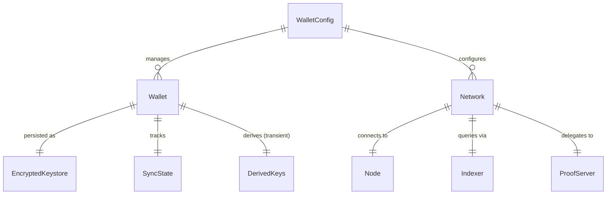

> ⚠️ **This spec is superseded.** It predates the wallet daemon work
> landed on `feat/tui-daemon`. The current architecture lives at
> [`docs/spec/wallet-service/`](../../docs/spec/wallet-service/) and
> the operational reference at
> [`docs/spec/wallet-service/COMMANDS.md`](../../docs/spec/wallet-service/COMMANDS.md).
> Treat this file as historical context, not current truth.
# Data Model: Isomorphic Wallet Tool

**Date**: 2026-05-01

## Entities

### Wallet

A named, encrypted identity containing HD-derived keys for all five Midnight
roles.

| Field | Type | Description |
|-------|------|-------------|
| name | string | User-assigned wallet name (unique per config) |
| mnemonic | Uint8Array (encrypted) | BIP-39 24-word mnemonic, encrypted at rest |
| account | number | BIP-44 account index (default 0) |
| keys | DerivedKeys | HD-derived keys for all 5 roles |
| network | string | Associated network identifier |
| syncState | SyncState | Current sync progress |
| createdAt | ISO 8601 | Creation timestamp |

**DerivedKeys** (transient — derived on unlock, zeroed after use):

| Field | Type | Derivation Path |
|-------|------|-----------------|
| nightExternal | Uint8Array | `m/44'/2400'/{account}'/0/{index}` |
| nightInternal | Uint8Array | `m/44'/2400'/{account}'/1/{index}` |
| dust | Uint8Array | `m/44'/2400'/{account}'/2/{index}` |
| zswap | Uint8Array | `m/44'/2400'/{account}'/3/{index}` |
| metadata | Uint8Array | `m/44'/2400'/{account}'/4/{index}` |

**Lifecycle**: Created → Locked (at rest, encrypted) → Unlocked (keys in memory)
→ Active (syncing/transacting) → Locked (keys zeroed)

### Network

A configured Midnight network endpoint.

| Field | Type | Description |
|-------|------|-------------|
| id | string | Network identifier (devnet, preview, preprod, custom) |
| nodeUrl | URL | WebSocket URL to Midnight node (default `ws://localhost:9944`) |
| indexerUrl | URL | HTTP URL to indexer GraphQL API (default `http://localhost:8088`) |
| proofServerUrl | URL | HTTP URL to proof server (default `http://localhost:6300`) |

**Predefined networks**:

| ID | Node | Indexer | Proof Server |
|----|------|---------|--------------|
| devnet | `ws://localhost:9944` | `http://localhost:8088` | `http://localhost:6300` |
| preview | `https://rpc.preview.midnight.network` | `https://indexer.preview.midnight.network/api/v4/graphql` | `http://localhost:6300` |
| preprod | `https://rpc.preprod.midnight.network` | `https://indexer.preprod.midnight.network/api/v4/graphql` | `http://localhost:6300` |

### WalletConfig

Top-level configuration for the tool.

| Field | Type | Description |
|-------|------|-------------|
| activeWallet | string | Name of the currently active wallet |
| wallets | string[] | List of wallet names |
| defaultNetwork | string | Default network if none specified (default: devnet) |
| networks | Record<string, Network> | Named network configurations |
| configVersion | number | Schema version for migration support |

**Storage location**: `~/.moth/config.json` (CLI), IndexedDB `moth` database
with `kv` object store using key-based namespacing (browser)

### EncryptedKeystore

The on-disk format for an encrypted wallet.

| Field | Type | Description |
|-------|------|-------------|
| version | number | Keystore format version |
| algorithm | string | Encryption algorithm identifier (e.g., `chacha20-poly1305`) |
| salt | Uint8Array | Random salt for key derivation |
| nonce | Uint8Array | Random nonce for encryption |
| ciphertext | Uint8Array | Encrypted mnemonic + metadata |
| tag | Uint8Array | Authentication tag (Poly1305) |

**Storage location**: `~/.moth/wallets/{name}.keystore` (CLI),
IndexedDB `moth` database with `kv` object store using key-based namespacing (browser)

### SyncState

Tracks wallet synchronization progress.

| Field | Type | Description |
|-------|------|-------------|
| highestEndIndex | number | Latest known zswap state end index |
| highestCheckedEndIndex | number | Latest checked index for this wallet |
| highestRelevantEndIndex | number | Latest relevant transaction index |
| lastBlockHeight | number | Last processed block height |
| lastBlockHash | string | Last processed block hash |
| sessionId | string | null | Active indexer session ID (from `connect` mutation) |
| updatedAt | ISO 8601 | Last sync timestamp |

**Storage location**: `~/.moth/wallets/{name}.sync` (CLI),
IndexedDB `moth` database with `kv` object store using key-based namespacing (browser)

### Transaction (output entity)

Structured representation of a transaction result returned to the user.

| Field | Type | Description |
|-------|------|-------------|
| hash | string | Hex-encoded transaction hash |
| status | enum | Submitted, InBlock, Finalized, Failed |
| blockHash | string | null | Block hash (once InBlock/Finalized) |
| blockHeight | number | null | Block height |
| contractAddress | string | null | Deployed contract address (deploy only) |
| fees | { paid: string, estimated: string } | Transaction fees in DUST |
| result | TransactionResultStatus | SUCCESS, PARTIAL_SUCCESS, FAILURE |

### ContractArtifact (input entity)

Compiled output from `compact compile` consumed by the deploy command.

| Field | Type | Description |
|-------|------|-------------|
| path | string | Filesystem path to compiled artifact directory |
| circuits | string[] | Available circuit names |
| initialState | Uint8Array | Serialized initial contract state |
| zkir | Uint8Array | Zero-knowledge IR for proof generation |

## Relationships

## Validation Rules

- Wallet names MUST be unique within a configuration
- Wallet names MUST match `^[a-zA-Z0-9_-]+$` (no spaces or special characters)
- Mnemonic MUST be a valid BIP-39 24-word phrase
- Network URLs MUST be valid URLs with appropriate schemes (ws/wss for node,
  http/https for indexer and proof server)
- Keystore version MUST be checked on load; incompatible versions fail with
  a clear error
- SyncState MUST be invalidated when the network's genesis hash changes
  (devnet reset detection)
